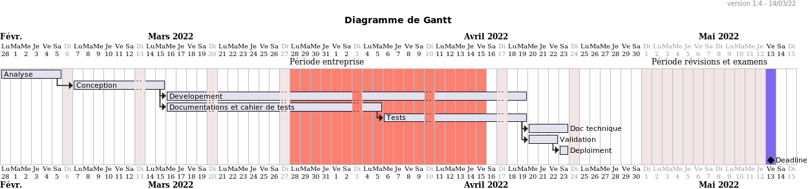
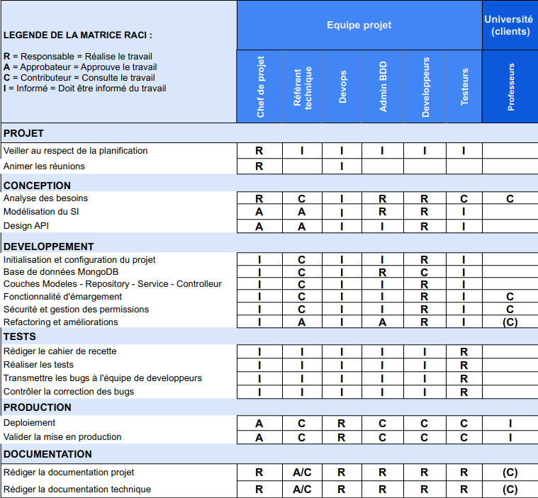

== Gestion du projet

=== Cycle de vie du projet

La gestion du projet de conception d'une API d'émargement s'est organisé en plusieurs étapes.

====
.Les phases du projet :
* Analyse des besoins
* Conception
* Développement
* Recette technique
* Production
====

=== Planification

===== Diagramme de Gantt prévisionnel

[IMPORTANT]

Nous n'avons pas pu nous en tenir à notre planification prévisionnelle par manque d'effectifs
et d'une minimisation de la charge de travail dans les phases de développement et de recette.
En effet, le retard accusé lors du développement et de la réalisation des tests, résulte de l'indisponibilité des ressources
lors des périodes d'entreprise, révisions et d'examens, nous avons mal évalué les risques liés à ces périodes.

=== Équipe projet

====
.Les membres de l'équipe :
* Fatima-Ezzahraa ELBARDI
* Moussa KONE
* Rachida EL OUARIACHI
* Solomon LOURDESSAMY
====

=== Matrice RACI

[NOTE]
La matrice RACI nous a permis d'identifier les tâches et de définir les responsabilités de chaque membre de l'équipe.

