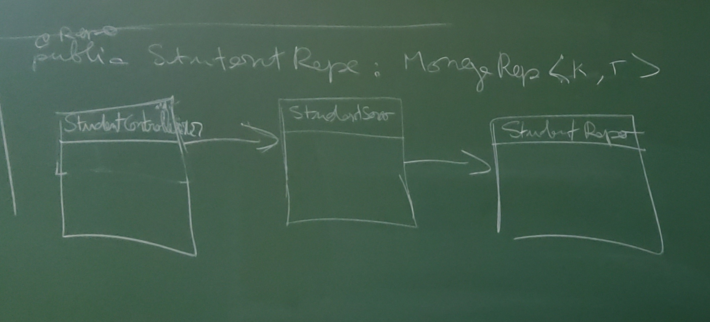

=== Compte Rendu du 11/03/2022

- *Points hebdomadaires :* _mercredi_ (20h~20h30) et _vendredi_ (13h30~14h)
- *Documentation :* -> choix d'_asciidoc_ pour tenir la doc (pour commencer)

==== Architecture du projet

*Package :*

- contrôleur
=> 1 controleur par entité  (=> 3 contrôleur : secretariat, étudiant, enseignant)
=> CRUD
- modèle => POJO (classes)
- service => CRUD
- repository => CRUD


=> Liens entre ces 4 "packages" => compositions


====== EXEMPLE :

```
@Service
public class StudentService {

@Autowired
private final StudentRepo sp;

public void ajouterStudent(Student s) {
    this.sp.save(s);
 }
}
```

```
@RestController
public StudentController {

@Autowired
    private final StudentService StuService;
}
```

```
@Repo
public StudentRepository extends MongoRepository <K,T> {
}
```

====== DIAGRAMME DE CLASSE :

